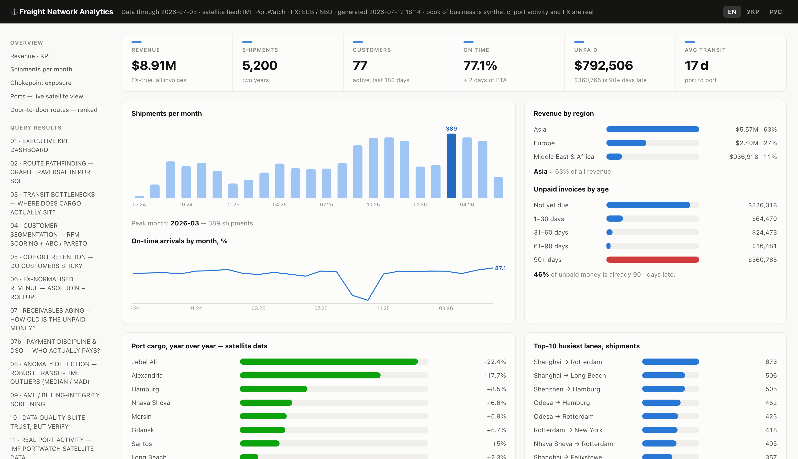
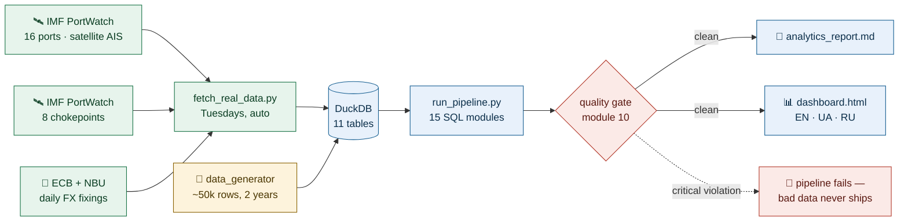
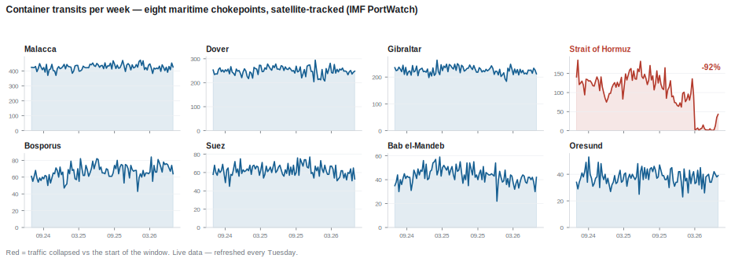
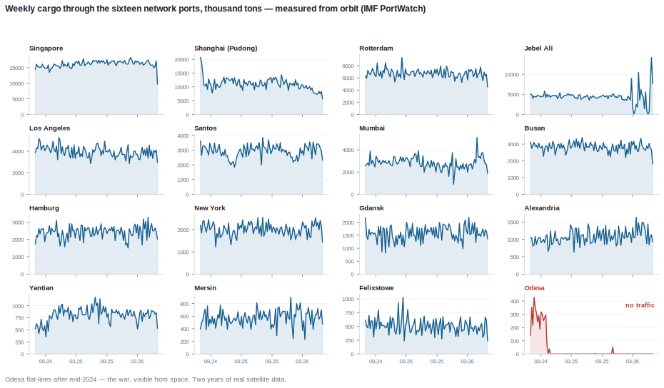
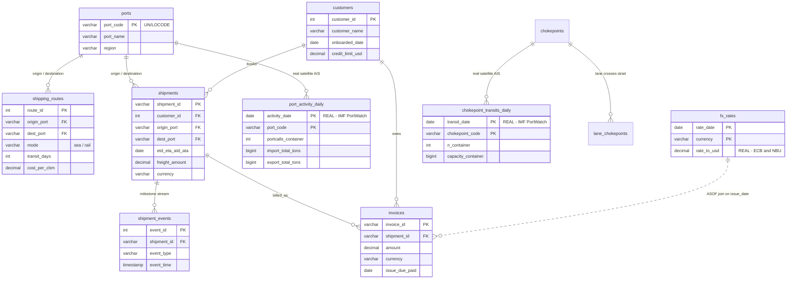

<div align="center">

# 🚢 Freight Network Analytics

### A freight forwarder's entire operation — modelled, screened and routed in advanced SQL — **wired to live satellite data**


<a href="https://yaroslavdeineka.github.io/freight-network-analytics/"><b>🛰 Live dashboard</b></a>
&nbsp;·&nbsp; <a href="#-quick-start">Quick start</a>
&nbsp;·&nbsp; <a href="#-the-15-analytical-modules">The 15 modules</a>
&nbsp;·&nbsp; <a href="#%EF%B8%8F-real-data-not-just-a-sandbox">Real data</a>
&nbsp;·&nbsp; <a href="#-engineering-guarantees">Guarantees</a>

[](https://yaroslavdeineka.github.io/freight-network-analytics/)

</div>

Two years of operations of a mid-size freight forwarder — **16 ports, 64
scheduled services, 80 customers, 5,200 shipments, ~45,000 tracking events,
5,200 multi-currency invoices** — analysed by **15 SQL modules** that go well
beyond `GROUP BY`: graph pathfinding with recursive CTEs, temporal ASOF
joins, robust MAD-based anomaly detection, an AML screening suite that
catches deliberately injected fraud, a multimodal door-to-door route
optimiser, and a chokepoint-exposure model fed by real strait transits.

The synthetic book of business is joined against **real, fresh data**:
daily satellite-AIS port activity *and* strait transits from the IMF, and
official ECB / NBU exchange-rate fixings. One script refreshes it all — no
API keys — and a GitHub Action re-fetches everything each Tuesday after the
IMF's weekly release. A second Action runs the pipeline and the test suite
on every push; the pipeline **fails itself** if the data-quality suite finds
a critical violation.

**Live dashboard:** <https://yaroslavdeineka.github.io/freight-network-analytics/>
— the full analytics workbench in one offline-capable HTML page (EN / UA / RU).

> [!NOTE]
> The domain mirrors my day job — I launched and run an LCL freight service
> at a logistics group — and my prior compliance work at an FCA-authorised
> payment institution. Every module answers a question I have actually been
> asked at work.
>
> **Why generated data?** Because the real thing is confidential. I work with
> exactly this kind of data daily, but publishing my company's actual
> customers, prices and payment behaviour is obviously not an option. So the
> operational layer is auto-generated to *behave* like a real book of
> business — and the repo demonstrates the method on data that is safe to
> share. Swap in your own tables and every module runs unchanged.

## 🔁 The pipeline at a glance



<sub>🟢 real satellite & central-bank data &nbsp; 🟡 engineered synthetic history
&nbsp; 🔵 the pipeline &nbsp; 🔴 the safety net</sub>

---

## ⚡ Quick start

```bash
git clone https://github.com/yaroslavdeineka/freight-network-analytics.git
cd freight-network-analytics
pip install -r requirements.txt

python3 data_generator/generate_data.py   # ~50k rows of engineered history
python3 fetch_real_data.py                # live IMF PortWatch + ECB/NBU FX (optional)
python3 run_pipeline.py                   # builds DuckDB, runs all modules
pytest -q                                 # smoke + regression tests (optional)
```

> [!TIP]
> No internet? Skip `fetch_real_data.py` — the pipeline runs fully offline
> on the committed cache, and the dashboard needs no CDN at all.

Results print to the console and land in two artifacts:
[`outputs/analytics_report.md`](outputs/analytics_report.md) — the full
freshness-stamped report — and **`outputs/dashboard.html`** — an analytics
workbench in a single dependency-free HTML file: KPI strip, live satellite
port table with sparklines, chokepoint-exposure bars, ranked door-to-door
routes, AML alerts, plus the complete result tables of all 15 modules,
switchable between English, Ukrainian and Russian. Skip the fetch step and
the pipeline still runs fully offline on synthetic data.

---

## 🛰️ Real data, not just a sandbox

| Source | What it feeds | Refresh |
|---|---|---|
| [IMF PortWatch](https://portwatch.imf.org/) — ports | Daily satellite-AIS port calls & cargo tonnage for all 16 network ports (~11,700 rows) | weekly (Tue) |
| IMF PortWatch — **chokepoints** | Daily vessel transits through Suez, Bab el-Mandeb, Bosporus, Malacca, Hormuz, Gibraltar, Dover, Oresund (~5,900 rows) | weekly (Tue) |
| ECB via [frankfurter.dev](https://frankfurter.dev/) | Daily EUR / GBP / CNY fixings | daily |
| [National Bank of Ukraine](https://bank.gov.ua/) | Daily UAH fixing | daily |

`fetch_real_data.py` caches everything as CSV in `data/real/` (each source
fails independently, with retries), so the pipeline stays reproducible
offline. When the cache is present, the ASOF-join FX conversion (module 06)
silently switches to **real fixings**, and modules 11–13 light up.

> [!IMPORTANT]
> The data is honest — current events are visible from orbit.
> **Zero container calls at Odesa** (the war). **Container transits through
> the Strait of Hormuz down ~93% year-on-year** (the 2026 Hormuz crisis) —
> which module 13 converts into re-route risk on the affected share of the
> book. None of this is scripted; it arrives with the Tuesday refresh.



<sub>*Eight straits, two years, one satellite feed — drawn straight from
`data/real/chokepoint_transits_daily.csv`. The red panel is the Hormuz
crisis as the ships actually experienced it.*</sub>



<sub>*The same feed at port level. Sixteen ports of the network, weekly
cargo in thousand tons; Odesa flat-lines after mid-2024.*</sub>

## 🧭 The 15 analytical modules

<sub>🛰️ = runs on live satellite data · 🚛 = optional plug-in, delete the folder to remove</sub>

| # | Module | Business question | Key SQL |
|---|--------|-------------------|---------|
| 01 | Executive KPIs | How is the business trending — beyond noisy MoM? | `LAG` (incl. 12-month offset), running totals, frames |
| 02 | **Route pathfinding** | All viable routings Odesa → Shanghai, ≤ 3 legs? | **Recursive CTE** graph traversal, cycle guard |
| 03 | Transit bottlenecks | *Where* does cargo actually sit? | `LAG` over event stream, median vs p90 tails |
| 04 | Customer segmentation | Who deserves key-account treatment? | RFM `NTILE(5)`, Pareto share, `FILTER` |
| 05 | Cohort retention | Do customers stick after onboarding? | Cohort matrix, quarter arithmetic |
| 06 | FX-normalised revenue | True USD revenue at the *correct historical rate*? | **`ASOF JOIN`**, `ROLLUP`, `GROUPING()` |
| 07 | Receivables aging | How old is the unpaid money? | Aging waterfall, data-derived as-of anchor |
| 07b | **Payment discipline & DSO** | Who actually pays, and how late? | `GROUPING SETS` inline total, DSO |
| 08 | **Robust anomaly detection** | Which shipments ran abnormally long *for their lane*? | **MEDIAN / MAD** modified z-scores |
| 09 | **AML screening** | Structuring under 10k? Duplicate billing? | ASOF-normalised amounts, **symmetric** `RANGE BETWEEN INTERVAL` frames |
| 10 | Data quality suite | Can we trust any of the above? | Assertion-style `UNION ALL` tests — **gates the pipeline** |
| 11 | 🛰️ **Real port activity** | What is happening at our 16 ports *right now*? | `FILTER`-ed sliding windows over live data |
| 12 | 🛰️ **Network exposure** | Where is our book concentrated vs real port trends? | Synthetic ⋈ real join, signal classification + feed-anomaly guard |
| 13 | 🛰️ **Chokepoint exposure** | How much of our book sails through Suez, Hormuz, the Bosporus? | Many-to-many exposure join over live strait transits |
| 14 | 🚛 **Door-to-door routing** | Best multimodal route Shanghai → Poltava? | Recursive pathfinding + live congestion penalties |

## ⏱️ The 5-minute tour

Three excerpts that show the level the modules operate at.

**Graph traversal in pure SQL** — the route network is a directed graph;
a recursive CTE walks it with a LIST-based cycle guard
([module 02](analytics/02_route_pathfinding.sql)):

```sql
SELECT p.origin_port, r.dest_port,
       list_append(p.path, r.dest_port),      -- accumulate the route
       p.total_days + r.transit_days,
       p.legs + 1
FROM paths p
JOIN shipping_routes r ON r.origin_port = p.dest_port
WHERE p.legs < 3
  AND NOT list_contains(p.path, r.dest_port)  -- never revisit a port
```

**Temporal joins done right** — every invoice converted at the FX fixing
actually in force on its issue date, one line, no correlated subquery
([module 06](analytics/06_fx_normalized_revenue.sql)):

```sql
FROM invoices i
ASOF JOIN fx_rates fx
    ON  fx.currency  = i.currency
    AND i.issue_date >= fx.rate_date
```

**Screening that survives review** — the structuring window is symmetric,
because a trailing-only frame under-counts the *first* invoices of a cluster
and silently drops them below the alert threshold
([module 09](analytics/09_aml_screening.sql)):

```sql
WINDOW w AS (
    PARTITION BY u.customer_id
    ORDER BY u.issue_date
    RANGE BETWEEN INTERVAL 14 DAY PRECEDING
              AND INTERVAL 14 DAY FOLLOWING
)
```

## 🗺️ The data model

<details>
<summary><b>Entity-relationship diagram</b> — 11 tables, click to unfold</summary>
<br/>



</details>

`shipping_routes` is a **directed graph** (ports = nodes, services = edges) —
that's what makes modules 02 and 14 possible. `lane_chokepoints` maps each
trade lane to the straits it sails through — that's what makes module 13
possible.

## 🚛 Door-to-door routing (plug-in extension)

*"I need cargo from Shanghai delivered to Poltava — via Odesa or via
Gdansk?"* Module 14 answers with a ranked top-3: sea legs over the network
graph + truck/rail inland legs + war-risk surcharge + **congestion buffer
days computed from the live PortWatch feed** — so the ranking re-shuffles
itself when fresh data arrives.

The whole feature lives in [`door_to_door/`](door_to_door/): its own schema,
editable tariff table and SQL. **Delete the folder and it's gone** — the
core pipeline doesn't reference it. Ask new questions by adding a row to
`route_requests`; details in the folder's [README](door_to_door/README.md).

## 🎯 Engineered realism (what the queries actually find)

The data generator embeds real operational patterns — and the SQL finds
every one of them:

- **A port congestion episode** at Rotterdam (Oct–Nov 2025): module 03
  surfaces a ~4.8× tail-to-median dwell ratio at NLRTM transshipment;
  monthly on-time performance craters to ~45%; module 08 flags the affected
  shipments at robust z-scores up to **10.8** — while the classic z-score,
  its baseline contaminated by the very outliers it hunts, stays under 4.4.
  That gap *is* the argument for median/MAD.
- **Q4 peak season and a Chinese-New-Year dip** — module 01, with a
  12-month `LAG` so growth is judged against the same month last year.
- **A Pareto customer book** — ~52% of revenue sits with 16 "Champion"
  accounts (module 04).
- **Customer churn** — ~18% of non-anchor accounts stop shipping 6–14
  months after onboarding: module 05's cohort curves now decay (100 → 90 →
  77 → 60%) instead of flat-lining, and module 04's Dormant segment is real.
- **Injected AML patterns** — four invoices of $9.4–9.6k within 6 days
  (structuring), three duplicated invoices. Module 09 catches **all of
  them** — each structuring invoice carries the full cluster evidence
  (a regression test keeps it that way); module 10 independently
  corroborates the duplicates.
- **Per-customer payment discipline** — prompt / slow / delinquent payer
  profiles produce a company DSO of ~47 days with the worst accounts at
  180–260 (module 07b), and a realistic 90+ overdue bucket (module 07).

## 🦆 Why DuckDB

- **`ASOF JOIN`** — temporal nearest-match (the kdb+ staple) in one line:
  every invoice converted at the fixing actually in force on its issue date.
- **Recursive CTEs + first-class lists** — graph pathfinding with a clean
  cycle guard, no string-hacking.
- **`MEDIAN` / `MAD` aggregates** — robust anomaly detection without
  shipping data out to Python.
- Full window-function, `ROLLUP`/`GROUPING SETS`, `FILTER` and percentile
  support; `INSERT OR REPLACE` for idempotent cache loads.
- Zero-install, single-file database — clone and run in seconds.

Most queries port to PostgreSQL with minor changes (ASOF → `LATERAL`
lookup; lists → arrays; MAD → percentile arithmetic).

## 🧪 Engineering guarantees

| | Guarantee | How it's enforced |
|---|---|---|
| ✅ | **Bad data never ships** | `run_pipeline.py` exits non-zero if module 10 finds a critical violation — the weekly refresh physically cannot commit it |
| ✅ | **The screens keep catching** | `pytest` rebuilds the DB from committed CSVs and asserts the AML screens catch **100%** of the injected patterns — a regression test, not a demo |
| ✅ | **Report ≡ dashboard** | both derive their as-of anchor from the data itself, never the wall clock, so receivables always agree |
| ✅ | **Every push is checked** | CI runs the pipeline + tests on each commit; the Tuesday refresh is concurrency-guarded |

## 📁 Repository structure

```
freight-network-analytics/
├── run_pipeline.py               # one-command build + run (15 modules, quality-gated)
├── fetch_real_data.py            # live IMF PortWatch (ports + chokepoints) + ECB/NBU FX
├── requirements.txt
├── schema/
│   └── 01_schema.sql             # DDL: 11 tables, constraints, indexes
├── data_generator/
│   └── generate_data.py          # engineered synthetic history (~50k rows)
├── data/
│   └── real/                     # cached REAL data (CSV, refreshed weekly)
├── analytics/                    # modules 01–13 (self-documented SQL)
├── door_to_door/                 # module 14 — optional, delete to remove
├── dashboard/                    # visual dashboard — optional, delete to remove
├── tests/                        # smoke + regression tests (pytest)
├── assets/                       # dashboard screenshot for this README
├── .github/workflows/            # CI + weekly data-refresh automation
└── outputs/
    ├── analytics_report.md       # consolidated, freshness-stamped report
    └── dashboard.html            # the analytics workbench (EN / UA / RU)
```

## ⚠️ Disclaimer

> [!WARNING]
> The book of business (customers, shipments, invoices) is **synthetic by
> design**: it is auto-generated so that no confidential data of my own
> company — or anyone else's — is exposed, while still showing exactly how
> such data can be analysed. It is —
> generated by `data_generator/generate_data.py`; company names are fictional.
> Port activity, strait transits and FX rates are real public data from IMF
> PortWatch, the ECB and the NBU. The lane → chokepoint mapping reflects
> standard liner routings and is a simplification; inland tariffs in
> `door_to_door/` are editable estimates, not market quotes.

---

<div align="center">

**Yaroslav Deineka** · MSc International Business with Business Analytics

[](https://www.linkedin.com/in/yaroslav-deineka-b91622323)
[](https://github.com/yaroslavdeineka)

<sub>If this repo taught you something, a ⭐ helps more people find it.</sub>

</div>
